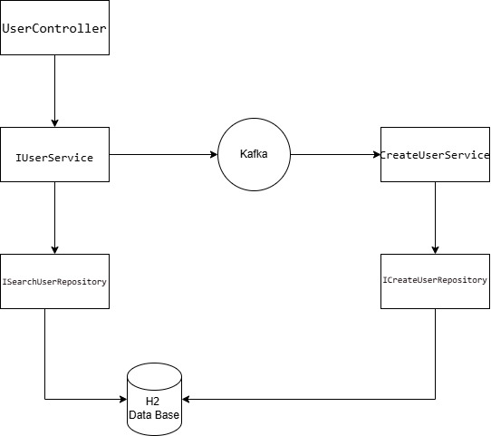

# 📘 User Management Microservice

Este microservicio maneja la creación, búsqueda y recuperación de usuarios. Está construido con Spring Boot y utiliza Kafka para procesamiento asíncrono de eventos.

---

## ⚙ Arquitectura General

Este servicio sigue una arquitectura basada en eventos usando Kafka, con controladores REST y consumidores asíncronos que manejan el procesamiento y persistencia.





##  Instalación y ejecución
###  1. Clonar el repositorio
```bash
git clone https://github.com/Gustav89/user-management-platform.git
cd user-management-platform
```
###  2. Configurar el archivo
**application.properties**
`src/main/resources/application.properties`

###  3. Compilar y ejecutar la aplicación
Ejecuta los siguientes comandos:

```bash
# Compilar el proyecto
mvn clean install

#Desde una terminar crear la red de docker
docker network create user_management_network

#Ejecutar docker compose de kafka
docker-compose -f docker-compose-kafka.yml up -d

#Ejecutar docker compose de redis
docker-compose -f docker-compose-redis.yml up -d

#entrer mediante terminal a kafka y crear topico
docker exec -it kafka-ibm bash
kafka-topics.sh --create --topic user-registration-events --bootstrap-server kafka:9092 --partitions 1 --replication-factor 1


#salir de kafka y ejecutar docker compose del servicio
docker-compose -f docker-compose-app.yml up -d

#ahora la aplicacion estara disponible en localhost:8080/api/v1/users
```

---
##  Documentación con Swagger
La documentación de la API está disponible en:
en ./src/main/resources/static/Ibm - API de User Management.yaml
---


---

## 🔁 Flujo de Creación de Usuario

1. **Cliente** envía un `POST /users` con datos del usuario.
2. **UserController** delega la petición a `UserServiceImpl`.
3. `UserServiceImpl` verifica si ya existe el usuario.
4. Si no existe, envía el evento al topic de Kafka `user-registration-events`.
5. El consumidor `CreateUserService` escucha ese topic, mapea el evento a entidad y persiste el usuario en la base de datos.

---

## 📱 Endpoints REST

### `POST /users`

Crea un nuevo usuario (procesamiento asíncrono).

- **Body**: `UserCreateRequest`
- **Response**: `StatusResponse`

### `GET /users/{id}`

Obtiene un usuario por UUID.

- **Response**: `UserResponse`

### `GET /users/search`

Busca usuarios filtrando por nombre y edad.

- **Params**: `name`, `age`, `Pageable`
- **Response**: `Page<UserResponse>`

---

## 🧱 Estructura del Proyecto

```
es.ibm.usermanagement
├── controller          --> Exposición de endpoints REST
├── dto                 --> Objetos de entrada y salida (DTOs)
├── entity              --> Entidades JPA
├── exception           --> Excepciones personalizadas
├── interceptor         --> Interceptores (validación, manejo de excepciones, etc.)
├── mapper              --> MapStruct para convertir DTO <-> Entity
├── repository          --> Repositorios Spring Data JPA
│   ├── ICreateUserRepository   --> Repositorio exclusivo para la creación de usuarios
│   └── ISearchUserRepository   --> Repositorio exclusivo para la búsqueda de usuarios
├── repository.spec     --> Especificaciones dinámicas para búsqueda
├── service             --> Interfaces de servicios
├── service.impl        --> Implementaciones (incluyendo lógica Kafka)

```

---

## 🧹 Patrones de Diseño Aplicados

- **Controller-Service-Repository**: Patrón típico de separación de capas en Spring.
- **DTO (Data Transfer Object)**: Separa la capa de presentación de la lógica interna.
- **Builder Pattern**: Para construir respuestas (`StatusResponse.builder()`).
- **Specification Pattern**: Para búsquedas dinámicas (`UserSpecifications`).
- **Event-Driven Architecture**: Envío de eventos a Kafka y consumo asíncrono.
- **Mapper Pattern (MapStruct)**: Conversión entre entidades y DTOs.
- **Interceptor para validación de parámetros**: Validación manual previa a la ejecución del controlador.

---


## 📜 Documentación OpenAPI (Swagger)

La API está documentada usando **OpenAPI 3.0**, lo cual permite generar documentación interactiva (Swagger UI) y facilita el consumo por parte de clientes externos.

---

## 🗾 Endpoints

### `POST /users`

Crea un nuevo usuario de forma **asíncrona** (mediante Kafka).

- **Request body**:
  ```json
  {
    "name": "Gustavo",
    "last_name": "Alvarez",
    "age": 35,
    "subscription": true,
    "postal_code": "1722"
  }
  ```
- **Response (202)**:
  ```json
  {
    "message": "User creation request accepted"
  }
  ```

### `GET /users/{id}`

Busca un usuario por su UUID.

- **Path Param**: `id` (UUID)
- **Response (200)**:
  ```json
  {
    "uuid": "07383d36-53dd-465c-89a6-5a069d00f963",
    "name": "Gustavo",
    "last_name": "Alvarez",
    "age": 35,
    "subscription": true,
    "postal_code": "1722",
    "created_at": "2025-04-10T14:30:00Z"
  }
  ```

### `GET /users/search`

Permite buscar usuarios con filtros opcionales por nombre y edad, y soporta paginación.

- **Query Params**:
    - `name` (opcional)
    - `age` (opcional)
    - `page` (default 0)
    - `size` (default 20)
- **Response (200)**:
  ```json
  {
    "content": [...],
    "pageable": {
      "page_number": 0,
      "page_size": 10
    },
    "total_elements": 100,
    "total_pages": 10
  }
  ```

---

## 📌 Esquemas importantes

- `UserCreateRequest`: Datos requeridos para crear un usuario.
- `UserResponse`: Representación completa de un usuario.
- `StatusResponse`: Mensaje de aceptación asíncrona.
- `ErrorResponse`: Información de error.


---
##  Contacto
- Email: [alvarezgustavomatias@gmail.com](mailto:alvarezgustavomatias@gmail.com)
- GitHub: [Gustav89](https://github.com/Gustav89)
---
**Desarrollado con Intelij por Gustavo Matias Alvarez**
